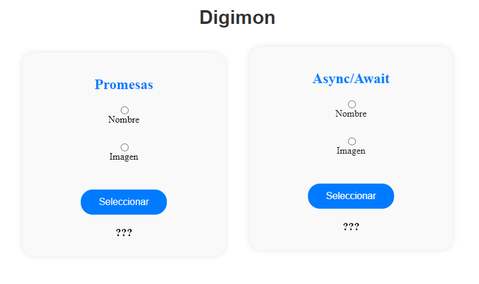
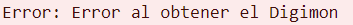

# T4.2Dev Promesas y Async/Await
Crea un interface web sencillo en el que implementes llamadas a una API de tu elección y consumas sus datos para mostrarlos por pantalla. Los datos que devuelve deben ser tanto imágenes y texto para cada caso.
## Como funciona
Estoy usando https://digimon-api.com/ para obtener a los digimon.

El usuario puede elegir si  obtener el nombre o la imagen de un digimon usando **Promesas** o **Async/Await**. En caso de elegir la imagen, esta se mostrara debajo del recuadro, en caso de ser el nombre, aparecerá en lugar de las interrogaciones.

El digimon en cuestion está denomidado con una constante en el código, *digimonID*, gracias a esto, se realiza la petición a la API para obtener tanto el nombre como la imagen.

## Caso de error
Un caso de error es cambiar en el código la *digimonID* a un número inferior a 1 o mayor a 1471, ya que ese es el límite de las ID en la API, por lo tanto se devuelve un error por consola.

https://fjrodryguez.github.io/T4.2Dev-Promesas-y-Async-Await/
